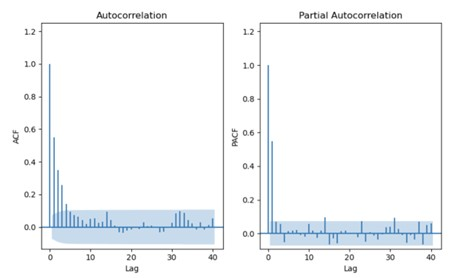
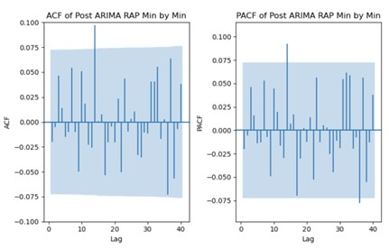
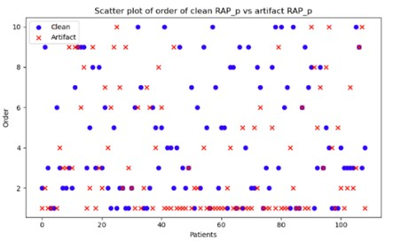

# ARIMA Modeling on EEG Time-Series Data

Time-series analysis and forecasting of EEG data (ICP, AMP, and RAP) using ARIMA modeling. Includes stationarity checks, residual analysis, artifact detection, and visualization.


<p>
  
  
  
  
  
  
</p>


## 📋 Table of Contents

- [About](#about)
- [Features](#features)
- [Data](#data)
- [Method](#method)
- [Result](#result)
- [Quick Start](#quick-start)
- [Installation](#installation)
- [Project Structure](#project-structure)
- [Associated Publication](#associated-publication)
- [Contributing](#contributing)
- [Support](#support)
- [Acknowledgments](#acknowledgments)

## About

This project builds a full ARIMA-based time-series analysis pipeline for EEG time series, ICP, AMP, and RAP signals. It runs stationarity checks, performs ARIMA modeling, generates residual diagnostics, plots ACF and PACF of residuals, and evaluates differences between clean and artifact-affected segments. The workflow processes every patient and every physiological parameter, produces plots and summary tables, and stores all metrics for later statistical comparison. The goal is to characterize RAP behavior, identify artifact patterns, and support downstream modeling of cerebral compensatory reserve in TBI data.

By leveraging Python's  libraries such as NumPy, Pandas, Matplotlib, Statsmodels, and Scikit-learn, the project offers a streamlined workflow for researchers and practitioners to extract meaningful insights from complex EEG datasets. This work has been published in MDPI's Sensors. The link to that can be found in the following section. 


## Features

- ⚡ **Stationarity Checks**: Implementation of Augmented Dickey-Fuller test to ensure data stationarity.
- 🎯 **Time-Series Analysis**: Comprehensive analysis of EEG data (ICP, AMP, RAP) using ARIMA models.
- 🎨 **Visualization**: Clear and informative visualizations of time-series data, model forecasts, and residuals.
- 📈 **Forecasting**: Predict future EEG data values using fitted ARIMA models.
- 🔒 **Artifact Detection**: Methods and features to identify and mitigate artifacts in EEG data.
- 🛠️ **Customizable**: Modular code structure allows for easy customization and extension.

## Data

The data were retrospectively obtained from the TBI database prospectively maintained at the Multi-omic Analytics and Integrative Neuroinformatics in the HUman Brain (MAIN-HUB) Lab at the University of Manitoba. This study included patient data collected from January 2018 to March 2023. 

## Method

```text

├── 1. Stationarity Analysis
│   │
│   ├── 1.1 Tests Used
│   │   ├── Augmented Dickey–Fuller (ADF)
│   │   └── Kwiatkowski–Phillips–Schmidt–Shin (KPSS)
│   │
│   ├── 1.2 Decision Rule (threshold = 0.05)
│   │   ├── ADF p-value < 0.05 → stationary
│   │   └── KPSS p-value > 0.05 → stationary
│   │
│   └── 1.3 Application
│       ├── Tests applied to raw data
│       └── Tests repeated on first-order differenced data
│
├── 2. ARIMA Modeling
│   │
│   ├── 2.1 ARIMA Framework
│   │   ├── Uses AR (p), differencing (d), and MA (q)
│   │   ├── Captures temporal structure of physiological signals
│   │   ├── ARIMA(p, d, q) fitted for each signal per patient
│   │   └── p, q ∈ [0,10] based on previous lab studies
│   │
│   ├── 2.2 Model Equation
│   │   └── Xt = c + εt + Σ φi Xt−i + Σ θj εt−j
│   │
│   ├── 2.3 Model Selection
│   │   ├── Evaluated all p, q combinations (d = 0 after differencing)
│   │   ├── Used statsmodels ARIMA implementation
│   │   └── Optimal model chosen using AIC score
│   │
│   └── 2.4 Statistical Metrics
│       ├── AIC → balanced metric
│       ├── BIC → more conservative
│       └── Log-Likelihood → raw fit measure
│
├── 3. Temporal Resolution Generation
│   │
│   ├── 3.1 Primary Resolution
│   │   └── Minute-by-minute ICP, AMP, RAP signals
│   │
│   ├── 3.2 Downsampled Resolutions
│   │   ├── 10-minute → mean of 10 points
│   │   ├── 30-minute → mean of 30 points
│   │   └── 60-minute → mean of 60 points
│   │
│   └── 3.3 Tools Used
│       └── pandas resample() for downsampling
│
├── 4. Model Evaluation
│   │
│   ├── 4.1 Median Optimal Model
│   │   ├── Median p across all patients
│   │   └── Median q across all patients
│   │
│   ├── 4.2 Diagnostics
│   │   ├── Residual magnitude
│   │   ├── ACF of residuals
│   │   ├── PACF of residuals
│   │   └── Count of significant spikes
│   │
│   └── 4.3 Model Quality Criteria
│       ├── Small residuals → good fit
│       └── No ACF/PACF spikes → structure captured
│
└── 5. RAP Artifact Segment Analysis
    │
    ├── 5.1 Artifact Identification
    │   ├── Experts created clean datasets
    │   ├── Non-clean contain extra segments
    │   └── Extra segments = true artifacts (timestamp-based)
    │
    └── 5.2 Artifact Extraction
        ├── Extract using times
        └── Save each artifact as a separate CSV file

```

## Result

### ACF and PACF Plots of Residuals Before ARIMA


### ACF and PACF Plots of Residuals After ARIMA


### Stationarity Check (p-values)
[ADF Test Original](csv/ADF_test_1min.csv)<br>
[KPSS Test Original](csv/ADF_test_1min_diff.csv)<br>
[ADF Test First Order Differenced](csv/KPSS_test_1min.csv)<br>
[KPSS Test First Order Differenced](csv/KPSS_test_1min_diff.csv)


### Optimal ARIMA Orders
[Optimal ARIMA Orders Clean](csv/arima_optimal_orders_clean.csv)<br>
[Optimal ARIMA Orders Artifacts](csv/arima_optimal_orders_artifact.csv)

### Scatterplots of Orders (Clean vs Artifact)


## Quick Start

Clone the repository and run the main script:

```bash
git clone https://github.com/Abrar-Islam-Oitijjho/ARIMA-Modeling-on-EEG-Time-Series-Data.git
cd ARIMA-Modeling-on-EEG-Time-Series-Data
pip install -r requirements.txt
jupyter notebook arima_analysis_main.ipynb
```

## Installation

### Prerequisites
- Python 3.7+
- pip 22.3+
- conda 24.11.3
- scikit-learn 1.0.2
- Pandas 1.3.5

## Project Structure

```
ARIMA-Modeling-on-EEG-Time-Series-Data/
├── code/               
    ├── data_preprocess.py          
    ├── arima_modeler.py            
    ├── artifact_analyzer.py     
    ├── artifact_detector.py
    ├── arima_analysis_main.ipynb
├── csv/            
├── plot/               
├── README.md              
└── requirements.txt                 
```

## Associated Publication

For more information please visit: [Characterization of RAP Signal Patterns, Temporal Relationships, and Artifact Profiles Derived from Intracranial Pressure Sensors in Acute Traumatic Neural Injury](https://www.mdpi.com/1424-8220/25/2/586)

## Contributing

Contributions are welcome!

### Quick Contribution Steps
1. 🍴 Fork the repository
2. 🌟 Create your feature branch (`git checkout -b feature/AmazingFeature`)
3. ✅ Commit your changes (`git commit -m 'Add some AmazingFeature'`)
4. 📤 Push to the branch (`git push origin feature/AmazingFeature`)
5. 🔃 Open a Pull Request


## Support

- 📧 **Email**: abraroitijjho35@gmail.com
- 🐛 **Issues**: [GitHub Issues](https://github.com/Abrar-Islam-Oitijjho/ARIMA-Modeling-on-EEG-Time-Series-Data/issues)

## Acknowledgments

- 📚 **Libraries used**:
  - [NumPy](https://numpy.org/) - Numerical computing library
  - [Pandas](https://pandas.pydata.org/) - Data analysis library
  - [Matplotlib](https://matplotlib.org/) - Visualization library
  - [Statsmodels](https://www.statsmodels.org/stable/index.html) - Statistical modeling library
  - [Scikit-learn](https://scikit-learn.org/stable/) - Machine learning library
  - 
🌟 Special thanks: to the MAIN-HUB Laboratory at the University of Manitoba, for their great support.
